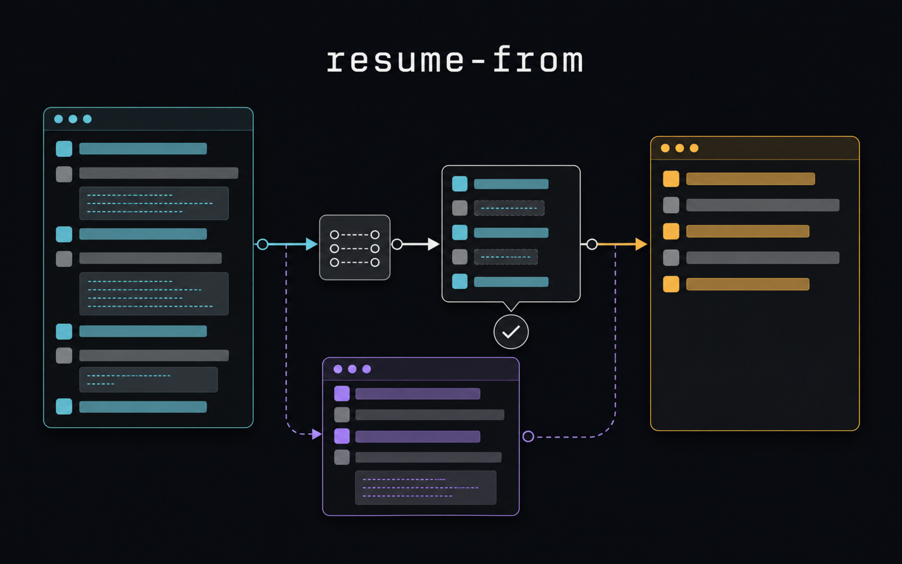
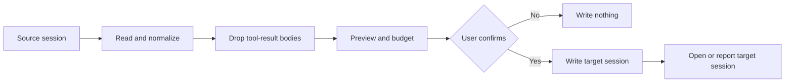

# resume-from

[](https://github.com/alexei-led/resume-from/actions/workflows/release.yml)
[](https://www.npmjs.com/package/resume-from)



Move a coding session from one coding agent to another.

## The problem

Coding agents keep session files in different formats and locations. A session
that starts in Claude Code does not open as a native session in Pi. A Codex
thread does not open as a Claude Code thread. Copying the file does not solve
this problem. The file formats differ, and tool results can contain stale or
sensitive data.

`resume-from` reads the source session and writes a new session in the target
agent format. It keeps the useful conversation, removes tool-result bodies,
shows a preview, and asks for confirmation. The source session stays unchanged.

## Core use cases

- Start a task in Codex, then continue it in Pi.
- Move from a terminal agent to a graphical agent.
- Continue a session from a second Claude Code profile.
- Recover the task after a context limit blocks the current session.
- Review exactly what will cross the agent boundary before anything is written.

The tool supports Pi, Claude Code, and Codex. It supports all source and target
directions between these agents.

| Target agent | Selection     | Landing                       |
| ------------ | ------------- | ----------------------------- |
| Pi           | Native picker | Opens the imported session    |
| Claude Code  | Numbered list | Prints `claude --resume <id>` |
| Codex        | Numbered list | Prints `codex resume <id>`    |

## How it works



## What moves

The new session contains:

- User messages and agent answers.
- Compaction summaries.
- Tool names, arguments, and short outcomes.
- The list of changed files.

The new session does not contain:

- Tool-result bodies.
- Vendor process state.

A dropped tool result has a marker. The target agent can read the current file
or run the command again.

## Safety rules

- It never changes the source session.
- It never writes before confirmation.
- It adds files in the target home. It does not replace or delete files.
- If the required content does not fit, it fails before writing.

## Install

Choose the guide for the agent that will receive the imported session:

- [Install and first import](docs/getting-started.md)
- [Pi](docs/agents/pi.md)
- [Claude Code](docs/agents/claude-code.md)
- [Codex](docs/agents/codex.md)
- [Configuration](docs/configuration.md)
- [Troubleshooting](docs/troubleshooting.md)

## Development

```sh
pnpm install
pnpm build
pnpm test
pnpm typecheck
pnpm lint
```

Run the command help after a build:

```sh
node dist/bin.js --help
```

## Project resources

- [Image brief for the Pi package gallery](docs/visual-assets.md)
- [Host shim and package boundaries](shims/README.md)
- [GitHub issues](https://github.com/alexei-led/resume-from/issues)

## License

MIT.
